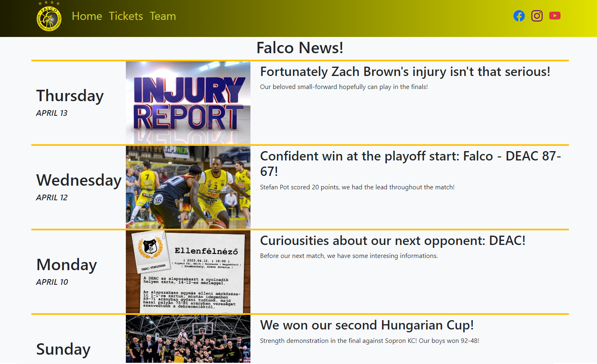
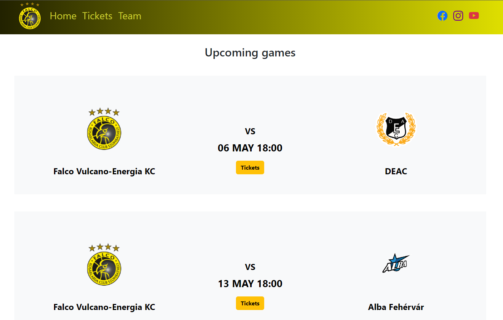
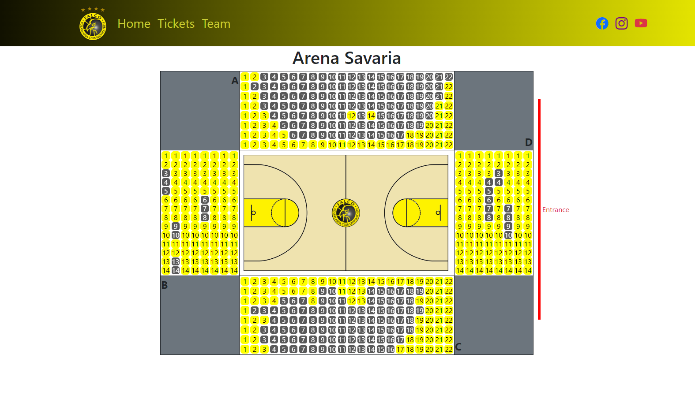
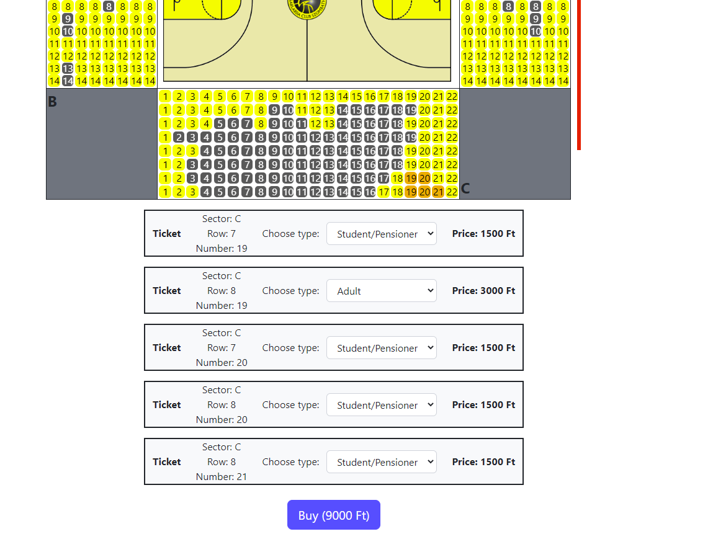
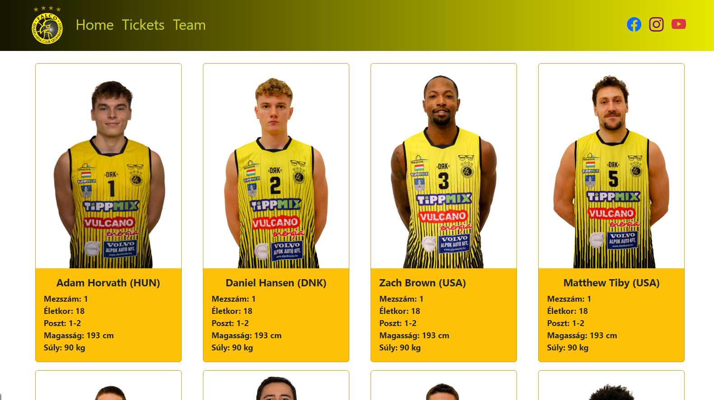
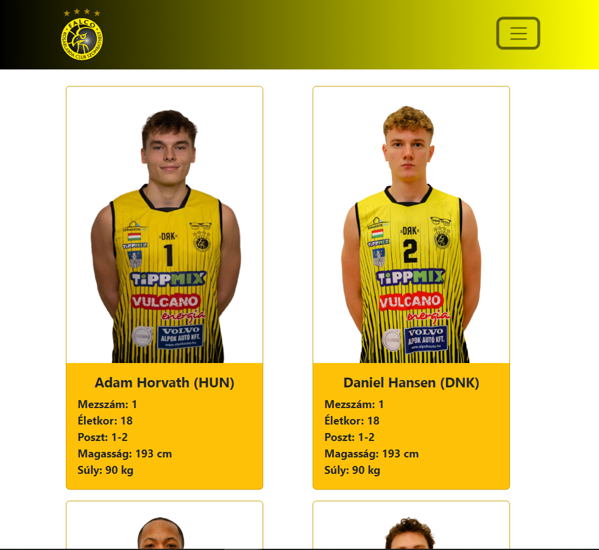
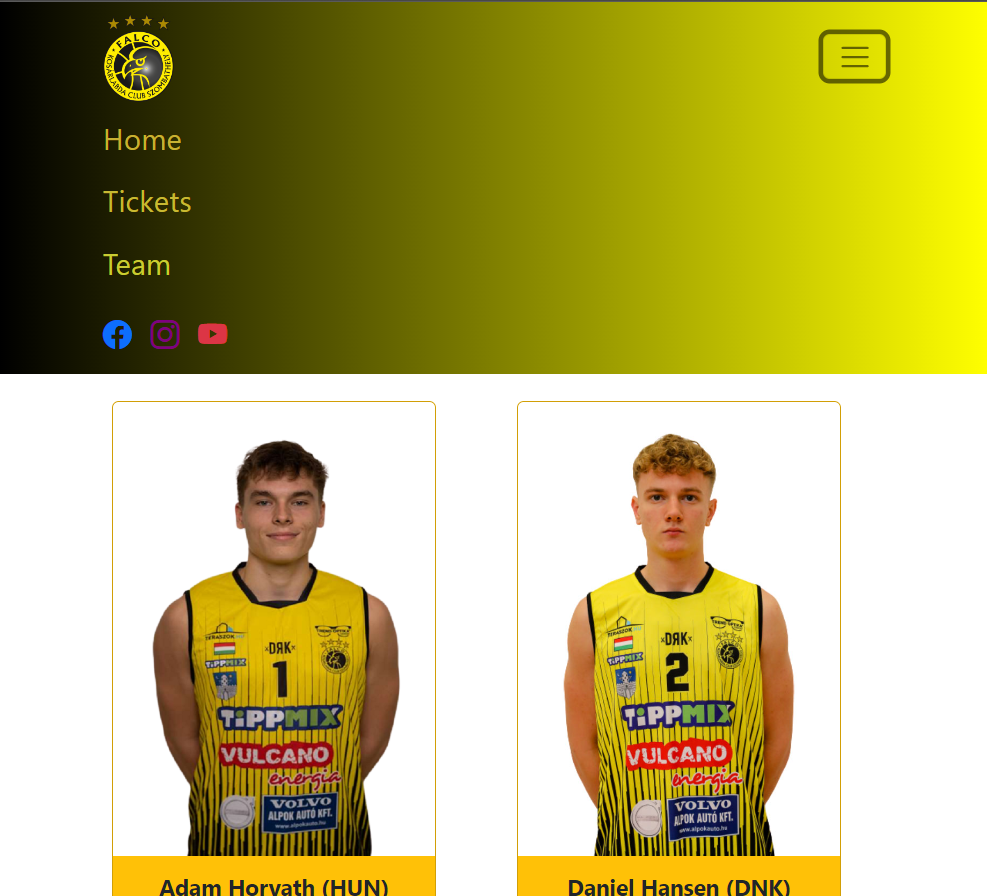

# Falco Basketball Club website with TicketingSystem by tothdodo

## Preview

A responsive website for a basketball club named **Falco KC Szombathely**. News feed, team check and ticket buy using seat-clicking options are available. Ticket purchases are saved into an **SQL Database** and **SignalR** is used to avoid transaction axioms. **Angular** frontend communicates with the data access layer by calling WebAPI endpoints which were created with **ASP.NET Core Framework**.

Still under construction, but has a lot of valuable functions.

## Technologies

- Angular
- Bootstrap
- VS Code
- ASP.NET Core
- Entity Framework
- SQL Database
- SignalR
- Visual Studio 2022

## Functionalities

- News feed
- Team check
- Social media links
- Upcoming games
- Ticket purchase
- Discount for students and pensioners

## Screenshots

## 1) **News** feed / **Home** page with navigation bar including social media links of the club

## 2) Clicking on **Tickets** we can scroll through the upcoming games, where we can see the details of the game and navigate to the chosen game with the **Tickets** button.

## 3) Court view with its all seats. Seats status (and color) can be bought, available, or marked.

## 4) Each marked seat we have a ticket row under the court, where we can see the prices, the ticket informations such as sector, row, seatnumber and type. We also have a **Buy** button, where we can continue our purchase. Function still under construction.

## 5) We can browse our favorite player in the **Team** section.

## 6)  Important that the website is responsive so the looking is perfect in each dimension.

